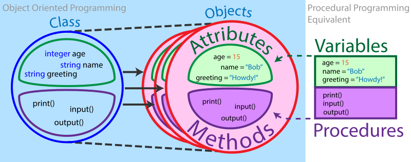

.. _how_to_write_design_code:

How to Write Design Code
========================

Many modern programming languages (including Python) allow for the creation of
**classes**: collections of values and functions that can be accessed while
programming. This makes classes well-suited for organizing related values and
functions, but why do we have to place them in a class? Isn't it enough to just
place them in the same file?

.. code-block:: python

    class Thingy:

        # We could just as easily move these variables and functions outside of
        # the class to use them.

        a = 20
        b = 30

        def add(self):
            return self.a + self.b

        def multiply(self):
            return self.a * self.b

The answer lies in **class instantiation**!

All Python classes (with the exception of abstract classes - we'll explain that
in a bit) can be instantiated as **objects**. An object is a representative of
the class from which it comes - in other words, an *instance* of the class. It
can use all of its class's functions (also known as *methods*), while
maintaining its own set of values that may be different from the values of other
objects from the same class.

Here is a general overview of how objects are used:

#. Instantiate an object from a class such that the object contains its own
   unique values.
#. Run that object's functions, which have different outcomes depending on the
   object's unique values.
#. Use multiple objects from different classes for even more different outcomes.

So then, why exactly are they called *objects*, and why are we using them for
water treatment research?

The answer is straightforward: **programming objects are great for representing
objects in the real world!** More specifically to us, they make it much easier
to design water treatment plant components. Here are some key ideas that govern
our use of objects:

* Just as how plants and components are designed to meet certain engineering
  specifications, component design objects can be instantiated such that each
  one has its own specifications as inputs.
* For the most part, we can use a given component's design inputs to directly
  calculate other important aspects of that component, like the expected head
  loss, or the length/width/height for when it's built in real life.
* The design of one component will usually affect the design of other
  components, so we can access multiple objects representing a set of components
  in order to cohesively design a plant.

.. code-block:: python

    # Complex component design at work
    >>> import aguaclara as ac
    >>> from aguaclara.core.units import u
    >>> sed = ac.Sedimentor(q = 40 * u.L / u.s)
    >>> sed.tank

This tutorial will show you how to write Python classes for designing an
AguaClara water treatment plant component. Using that class, you can instantiate
objects and design hypothetical components which can be built in real life!
Neat, huh?

This guide assumes knowledge of basic Python syntax. For a refresher, see the
`AguaClara Writing Python Code guide
<https://aguaclara.github.io/aguaclara_tutorial/python-and-hydrogen/writing-python-code.html>`_.

.. toctree::
    :maxdepth: 2

    coding_conventions
    component_class
    design_code_example
