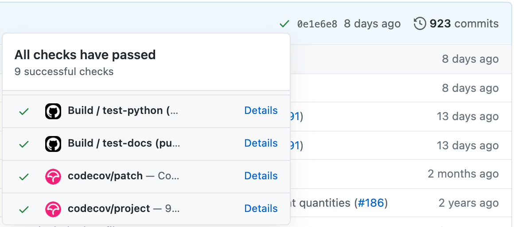

.. _guide-dev:

.. |aguaclara Github| replace:: ``aguaclara`` Github repository
.. _aguaclara Github: https://github.com/AguaClara/aguaclara

.. |aguaclara issues| replace:: ``aguaclara`` Github repository issues
.. _aguaclara issues: https://github.com/AguaClara/aguaclara/issues

.. |aguaclara actions| replace:: ``aguaclara``'s Github Actions page
.. _aguaclara actions: https://github.com/AguaClara/aguaclara/actions

.. |flake8| replace:: ``flake8``, a Python linter (code style checker),
.. _flake8: https://flake8.pycqa.org/en/latest/

.. |black| replace:: ``black``, an automatic code formatter,
.. _black: https://black.readthedocs.io/en/stable/

.. |Sphinx autodoc extension| replace:: Sphinx ``autodoc`` extension
.. _Sphinx autodoc extension: https://www.sphinx-doc.org/en/master/usage/extensions/autodoc.html

===============
Developer Guide
===============

Where to Start
--------------
Whether you're are maintainer of ``aguaclara`` or a user with a bug fix, feature, or enhancement in mind, the |aguaclara issues|_ are a great place to start. 

Before working, **browse the issues to check if the update you have in mind has already been documented and assigned to a developer**. If a relevant issue doesn't exist, go ahead and make one with the green button labeled "New Issue". If/once an issue does exist, there a few ways to proceed:

* if you're a collaborator of the ``aguaclara`` repository, assign yourself to the issue.
* if you're not a collaborator, either ask a collaborator to make you a collaborator as well, or ask the collaborator to assign you to the issue.

Feel free to use the issue for commenting on your progress or asking other users or collaborators for help with your development.

Setting Up Your Local Environment
---------------------------------
If you want to make changes to ``aguaclara``, you should make the package available locally.

#.  Make sure to have Python, ``pip``, and Git installed (for guidance, see :ref:`install-software`). Check the package's `Pypi <https://pypi.org/project/aguaclara/>`_ page for the required Python version. If you must have a different version on your computer for another project, you can use `pyenv <https://github.com/pyenv/pyenv#simple-python-version-management-pyenv>`_ to manage multiple Python versions.

#.  Install `Pipenv <https://pypi.org/project/pipenv/>`_, a package management and virtual environment tool, by running the following command in the command line:
   
    .. code:: 
    
        pip install pipenv

#.  In the command line, navigate to the directory in which you'll keep your local copy of the ``aguaclara`` Git repository.
   
    * If you're not a collaborator, you'll need to first fork the repository on Github.

#.  Clone the repository or your fork of the repository into that directory:

    .. code::
        
        (Cloning original repository)
        git clone https://github.com/AguaClara/aguaclara.git

        (Cloning forked repository)
        git clone https://github.com/{your_username_here}/aguaclara.git
    
#.  Navigate into the newly cloned repository and install it in editable mode, so that your environment uses this repository as your ``aguaclara`` package, even as you edit it:

    .. code::

        cd aguaclara
        pip install --editable . -U --user

    To install the package in editable mode in a virtual environment only, replace the second line with ``pipenv install --dev -e .`` (``.`` passes the current directory as an argument to the ``-e`` flag, short for "editable").

#.  Install the package's user dependencies and development dependencies:

    .. code::

        pipenv install
        pipenv install --dev
    
    ``pipenv`` is used to install the dependencies from the file called ``Pipfile`` into a virtual environment. Click :ref:`here <pipenv>` for more details on ``pipenv``, ``Pipfile``, and virtual environments. 

#.  You can check whether you have a fully provisioned testing environment now by running:

    .. code::

        pipenv run pytest
    
    The tests should all pass. If they don't, check in with the latest `Github Actions build of the master branch <https://github.com/AguaClara/aguaclara/actions?query=branch%3Amaster>`_ to see what difference between the Github Actions environment and your local environment could make the tests fail.

Branching
---------
Before you develop, it's important to understand the branching conventions for the ``aguaclara`` repository.

The Master Branch
*****************
The master branch is the branch that houses ``aguaclara``'s published releases. Therefore, the master branch is a *protected* with rules (on Github) that

* pull requests are required before merging into the branch,
* only administrators and maintainers can push to the branch, and
* status checks are required before merging or pushing to the branch.

Your Development Branch
***********************
This means that all work starts on *development branches*, or task or feature branches. (Check out this `article <https://www.atlassian.com/agile/software-development/branching>`_ if you want to learn more!)
It is recommended that you name your branch ``{your_development_type}/short-description``. Some examples of development type are 

.. hlist::
    :columns: 2

    * ``feature``
    * ``bugfix``
    * ``enhancement``
    * ``documentation``
    * ``test`` (for additions/updates to tests)
    * ``build`` (for updates to the build process)

To make and switch to your new branch, run:

.. code::

    git checkout -b {your_development_type}/short-description

Documentation and Test Driven Development
-----------------------------------------
1. Write Documentation
**********************
Your development should begin with documentation -- that is, creating a blueprint of the code you plan to write. **In this blueprint, each new or modified module, function, class, or method should be defined with a documentation string (i.e. comments, specifications, docstring) that describes its purpose and functionality, before any code is written**.
You can read more about documentation driven development (DDD) in this short `blog <https://collectiveidea.com/blog/archives/2014/04/21/on-documentation-driven-development>`_.

.. Commented out: The primary purpose of the documentation is to inform users how the code is intended to be used and behave. The purpose of the documentation process is to make you, as the developer, consider the best interface for the user. Plus, it lays a clearer roadmap to the end product and is crucial for helping others (and yourself!) to understand and debug the code.

The ``aguaclara`` package uses Sphinx and Numpy docstring formats. For more details on writing docstrings, see our :ref:`doc-conventions`. 

**If possible, gather feedback from likely users after writing the documentation.** Modifications are much more easily made to documentation than to code. 

2. Write a Test
***************
Next, write a unit test for your code based on the documentation. A unit test tests a basic unit, e.g. function or method, of your code. **If a unit of code produces the expected (documented) outputs for accepted inputs, its test should pass. If it behaves any differently from what is described in its documentation, its test should fail.**
Make sure to test all types and/or edge cases of accepted inputs (this last part is known as `black box testing <https://www.guru99.com/black-box-testing.html>`_). You can read more about test driven development (TDD) `here <https://www.agilealliance.org/glossary/tdd/>`_.

.. Commented out: Like DDD, test driven development (TDD) focuses on specifying the code most optimally for the user by putting the developer in the user's shoes. TDD also leads to cleaner and better designed code than traditional testing. 

The ``aguaclara`` package uses the ``numpy`` and ``unittest`` packages for testing Python code. For more details on Python testing, see [ADD TUTORIAL LINK HERE].

All test files should be located in the ``tests/`` directory. To execute the tests in a test file, run the following command in the command line:

.. code::

    pipenv run pytest path/to/file -v

where the ``-v`` flag gives a verbose (more descriptive) output. To execute specific tests in a test file, run:

.. code::

    pipenv run pytest path/to/file -v -k name_of_test

3. Write Code to Pass Failing Test
**********************************
Since you haven't written any code yet, your test should fail. Now write just enough code to pass the failing test.

For code style conventions, refer to `Python's Style Guide <https://www.python.org/dev/peps/pep-0008/>`_. You can also use |flake8|_ and |black|_ to achieve proper style.

4. Refactor
***********
If your test still fails, refactor (modify) your code, still keeping it as simple as possible, until the test passes.

5. Repeat
*********
Repeat steps 3 and 4 until tests cover all the functionalities described in the documentation.

Sphinx Documentation
--------------------
Sphinx and RST
**************
``aguaclara``'s documentation, including this page, is built using a tool called `Sphinx <https://www.sphinx-doc.org/en/master/>`_, which uses reStructuredText (RST, ReST, or reST) as its markup language. RST files have the extension ``.rst``. The source files for ``aguaclara``'s documentation are found in the ``docs/source`` directory.
For a brief introduction to RST concepts and syntax, see `Sphinx's reStructuredText Primer <https://www.sphinx-doc.org/en/master/usage/restructuredtext/basics.html>`_. 

Automated Documentation
***********************
You may have noticed that ``aguaclara``'s modules, classes, functions, and constants are not manually documented in the API Reference pages. Instead, they are automatically documented using an RST directive, ``.. automodule::``, which reads the docstrings in the source code. **Hence, docstrings must be written in correst RST and can include all the usual RST markup (e.g. headers, code blocks).** 
For more details on including documentation from docstrings, see the |Sphinx autodoc extension|_.

Previewing Documentation
************************
Some IDEs offer extensions for previewing the HTML pages that Sphinx generates from the RST files. (One great extension is `reStructuredText by LexStudio, Inc. <https://marketplace.visualstudio.com/items?itemName=lextudio.restructuredtext>`_ for `Visual Studio Code <https://code.visualstudio.com/>`_.) You can also build the documentation from the command line:

.. code::

    cd docs
    pipenv run make html

The resulting HTML files will be written to the ``docs/build/html`` directory. You can then open and interact with them in a browser.

Validating Documentation
************************
The ``html-proofer`` package can be used to check the correctness of the rendered HTML pages (e.g., that there are not broken links). To install the package, `download RubyGems <https://rubygems.org/pages/download>`_ and then run:

.. code::

    gem install html-proofer
    cd docs
    htmlproofer build/html --allow_hash_href --file_ignore "build/html/search.html"

Alternatively, you can commit your changes, push them to Github, and check the "Build" workflow for your commit in |aguaclara actions|_ (or that of your forked repository). See :ref:`github-actions` for more details.

Committing and Pushing
----------------------
It's a good idea to **commit your work early and commit often**. Saving more snapshots of your work through Git facilitates debugging and resetting code while logging your progress.

#.  Before committing, check if your work generated any user, operating system, or IDE specific or other otherwise unnecessary developer files in your ``aguaclara`` repository. If so, add their files names or directories to the ``.gitignore`` file.

#.  If you have files in a directory named ``tests/rst_files``, run in the command line:

    .. code::

        git update-index --skip-worktree tests/rst_files/*

#.  Now, stage your changes and commit them with a short but descriptive commit message. From the ``aguaclara`` root directory, run:

    .. code::

        git add .
        git commit -m "your message here"

#.  Make sure to also occasionally pull commits from the remote Github repository, if anyone else is working on your branch, and to push your commits:

    .. code::

        git pull
        git push

For more guidance on using Git in the command line, see the `AguaClara Tutorial Wiki <https://aguaclara.github.io/aguaclara_tutorial/git-and-github/git-in-the-command-line.html>`_.

.. _github-actions:

Continuous Integration via Github Actions
-----------------------------------------
Continuous integration (CI) is a software development practice that allows multiple developers to frequently merge code into a shared repository. CI usually involves automated tests and builds of the code to make sure it is correct before integration.
The ``aguaclara`` package uses Github Actions for continuous integration. More specifically, several "workflows" have been defined in the ``.github/workflows`` directory to accomplish various tasks:

.. list-table::
    :header-rows: 1

    *   - Workflow
        - Trigger
        - Tasks
    *   - Build
        - Push, pull request
        - Validate code and documentation, check code coverage
    *   - Documentation
        - Push to master branch
        - Build and publish Sphinx documentation 
    *   - Publish to Pypi
        - Publishing of release
        - Build and publish the package to Pypi

The `Github Actions documentation <https://docs.github.com/en/actions>`_ is a great place to learn more about workflows and other aspects of Github's CI platform.

Checking Workflow Results
*************************
Results of workflow runs can be viewed in the `Actions <https://github.com/AguaClara/aguaclara/actions>`_ tab of the ``aguaclara`` Github repository. If a job fails in the Build workflow for your latest push, find the error in the job's log and debug from there.

Checking Code Coverage
**********************
Code coverage is a measure of the amount of source code that has been executed by tests. Whenever possible, all new or modified code should be covered by tests, so code coverage should either remain the same or increase with each contribution. 
The Build workflow calculates code coverage and uploads a report to `Codecov <https://app.codecov.io/gh/AguaClara/aguaclara/>`_. The actual change (diff) in coverage can then be viewed on Codecov or in the dropdown of status checks next to the commit ID on Github (click on either a green check or red X).

You can also view on Codecov (or on Github with a browser extension) which lines of code were executed during testing and which were skipped. If the coverage for your code is incomplete, and especially if the coverage diff is negative, add test cases to test the skipped lines of code. 
If you added a file of code that *cannot be reasonably tested*, you may add it to the list of files and directories ignored by Codecov in ``codecov.yml``. (Note: such files are rare!)

Pull Requests
-------------
