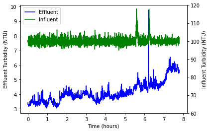

=========================================
Data Parsing, Analysis, and Visualization
=========================================

Reading and visualizing data from a ProCoDA data file
-----------------------------------------------------
First, like always, we need to import the packages that we'll be using: 

.. code:: python
  
    import aguaclara as ac
    from aguaclara.core.units import u
    import matplotlib.pyplot as plt

Then, paste the link or path to the file of the data that you want to analyze or visualize. 

.. code:: python

    path = "https://raw.githubusercontent.com/AguaClara/team_resources/master/Data/datalog%206-14-2018.xls"

Now we can start looking at the data! `ProCoDA Parser <https://aguaclara.github.io/aguaclara/research/procoda_parser.html>`_ has some methods that can help us extract data from the file. Here, we'll be using ``column_of_time`` and ``column_of_data``, but be sure to check out the documentation for methods that you need!

.. code:: python
  
    time = ac.column_of_time(path=path, start=2250, end=5060).to(u.hr)
    influent_turbidity = ac.column_of_data(path=path, start=2250, column=3, end=5060)
    effluent_turbidity = ac.column_of_data(path=path, start=2250, column=4, end=5060)

`Matplotlib <https://matplotlib.org/stable/contents.html>`_ is a plotting library for Python, and we'll be using it to plot our data (We imported it as ``plt``). Note that we can make multiple subplots on the same graph. 

.. code:: python

    # set up multiple subplots with same x-axis
    fig, ax1 = plt.subplots()
    ax2 = ax1.twinx()

    # make the first subplot (Effluent Turbidity vs Time)
    ax1.set_xlabel("Time (hours)")
    ax1.set_ylabel("Effluent Turbidity (NTU)")
    line1, = ax1.plot(time, effluent_turbidity, color="blue")

    # make the second subplot (Influent Turbidity vs Time)
    ax2.set_ylabel("Influent Turbidity (NTU)")
    ax2.set_ylim(60,120)
    line2, = ax2.plot(time, influent_turbidity, color="green")

    plt.legend((line1, line2), ("Effluent", "Influent"))

.. code:: python
    import aguaclara as ac
    from aguaclara.core.units import u
    import matplotlib.pyplot as plt
    
    path = "https://raw.githubusercontent.com/AguaClara/team_resources/master/Data/datalog%206-14-2018.xls"

    time = ac.column_of_time(path=path, start=2250, end=5060).to(u.hr)
    influent_turbidity = ac.column_of_data(path=path, start=2250, column=3, end=5060)
    effluent_turbidity = ac.column_of_data(path=path, start=2250, column=4, end=5060)

    # set up multiple subplots with same x-axis
    fig, ax1 = plt.subplots()
    ax2 = ax1.twinx()

    # make the first subplot (Effluent Turbidity vs Time)
    ax1.set_xlabel("Time (hours)")
    ax1.set_ylabel("Effluent Turbidity (NTU)")
    line1, = ax1.plot(time, effluent_turbidity, color="blue")

    # make the second subplot (Influent Turbidity vs Time)
    ax2.set_ylabel("Influent Turbidity (NTU)")
    ax2.set_ylim(60,120)
    line2, = ax2.plot(time, influent_turbidity, color="green")

    plt.legend((line1, line2), ("Effluent", "Influent"))

Want to try this out? **Interact and play with the code** `here <https://colab.research.google.com/drive/1joy4iTLnghUb5vSLPC6wd-mnXC8HZnVM?usp=sharing>`_!